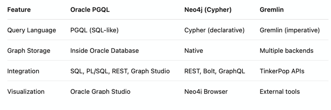
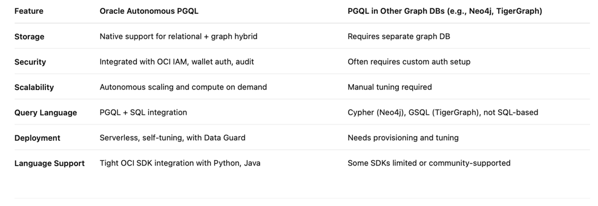

## Understanding Graph Theory and Implementing a Knowledge Graph with Oracle Autonomous Database and PGQL

### Introduction

This document explores the concepts of graph theory, knowledge graphs, and how they are implemented using the Oracle Autonomous Database with PGQL (Property Graph Query Language). It also explains the Python implementation used to extract relationships from documents using LLMs and store them as graph structures in Oracle.

### What is Graph Theory?

Graph theory is a field of mathematics and computer science focused on modeling relationships between objects. A graph consists of:

•	**Vertices** (nodes): Represent entities.

•	**Edges** (links): Represent relationships between entities.

Graphs are widely used for representing data structures in social networks, semantic networks, knowledge graphs, and more.

### What is a Knowledge Graph?

A knowledge graph is a graph-based representation of real-world knowledge where:

•	Nodes represent entities (people, places, products, etc.)

•	Edges represent semantic relationships (e.g., “WORKS_AT”, “PART_OF”)

Knowledge graphs enhance semantic search, recommendation systems, and question-answering applications.

### Why Use Oracle Autonomous with PGQL?

Oracle provides a fully managed environment to store and query property graphs:

•	PGQL (Property Graph Query Language) is SQL-like and designed for querying complex graph patterns.

•	Oracle Autonomous Database allows running graph queries natively with property graph features, including creation, querying, and visualization.

•	Integration with LLMs enables automatic extraction of graph structures from unstructured data (like PDFs).

### Comparison with Other Graph Query Languages



### Advantages of Oracle Autonomous PGQL vs Traditional Graph DBs



### Create Knowledge Graph

This is the processes executed on this service:

•	Creating the graph schema

•	Extracting entities and relationships using LLM

•	Inserting data into Oracle

•	Building the property graph


```python
def create_knowledge_graph(chunks):
    cursor = oracle_conn.cursor()

    # Creates graph if it does not exist
    try:
        cursor.execute(f"""
        BEGIN
            EXECUTE IMMEDIATE '
                CREATE PROPERTY GRAPH {GRAPH_NAME}
                  VERTEX TABLES (ENTITIES
                    KEY (ID)
                    LABEL ENTITIES
                    PROPERTIES (NAME))
                  EDGE TABLES (RELATIONS
                    KEY (ID)
                    SOURCE KEY (SOURCE_ID) REFERENCES ENTITIES(ID)
                    DESTINATION KEY (TARGET_ID) REFERENCES ENTITIES(ID)
                    LABEL RELATIONS
                    PROPERTIES (RELATION_TYPE, SOURCE_TEXT))
            ';
        EXCEPTION
            WHEN OTHERS THEN
                IF SQLCODE != -55358 THEN -- ORA-55358: Graph already exists
                    RAISE;
                END IF;
        END;
        """)
        print(f"🧠 Graph '{GRAPH_NAME}' created or already exists.")
    except Exception as e:
        print(f"[GRAPH ERROR] Failed to create graph: {e}")

    # Inserting vertices and edges into the tables
    for doc in chunks:
        text = doc.page_content
        source = doc.metadata.get("source", "unknown")

        if not text.strip():
            continue

        prompt = f"""
        You are an expert in knowledge extraction.

        Given the following technical text:

        {text}

        Extract key entities and relationships in the format:
        - Entity1 -[RELATION]-> Entity2

        Use UPPERCASE for RELATION types.
        Return 'NONE' if nothing found.
        """
        try:
            response = llm_for_rag.invoke(prompt)
            result = response.content.strip()
        except Exception as e:
            print(f"[ERROR] Gen AI call error: {e}")
            continue

        if result.upper() == "NONE":
            continue

        triples = result.splitlines()
        for triple in triples:
            parts = triple.split("-[")
            if len(parts) != 2:
                continue

            right_part = parts[1].split("]->")
            if len(right_part) != 2:
                continue

            raw_relation, entity2 = right_part
            relation = re.sub(r'\W+', '_', raw_relation.strip().upper())
            entity1 = parts[0].strip()
            entity2 = entity2.strip()

            try:
                # Insertion of entities (with existence check)
                cursor.execute("MERGE INTO ENTITIES e USING (SELECT :name AS NAME FROM dual) src ON (e.name = src.name) WHEN NOT MATCHED THEN INSERT (NAME) VALUES (:name)", [entity1, entity1])
                cursor.execute("MERGE INTO ENTITIES e USING (SELECT :name AS NAME FROM dual) src ON (e.name = src.name) WHEN NOT MATCHED THEN INSERT (NAME) VALUES (:name)", [entity2, entity2])
                # Retrieve the IDs
                cursor.execute("SELECT ID FROM ENTITIES WHERE NAME = :name", [entity1])
                source_id = cursor.fetchone()[0]
                cursor.execute("SELECT ID FROM ENTITIES WHERE NAME = :name", [entity2])
                target_id = cursor.fetchone()[0]
                # Create relations
                cursor.execute("""
                    INSERT INTO RELATIONS (SOURCE_ID, TARGET_ID, RELATION_TYPE, SOURCE_TEXT)
                    VALUES (:src, :tgt, :rel, :txt)
                """, [source_id, target_id, relation, source])
                print(f"✅ {entity1} -[{relation}]-> {entity2}")
            except Exception as e:
                print(f"[INSERT ERROR] {e}")

    oracle_conn.commit()
    cursor.close()
    print("💾 Knowledge graph updated.")
```


•	The graph schema is created with CREATE PROPERTY GRAPH, linking ENTITIES (vertices) and RELATIONS (edges).

•	Uses MERGE INTO to insert new entities only if they don’t exist (ensuring uniqueness).

•	LLM (Oracle Generative AI) is used to extract triples of the form Entity1 -[RELATION]-> Entity2.

•	All interactions with Oracle are done via oracledb and PL/SQL anonymous blocks.

#### Next Steps


•	Use PGQL to explore and query graph relationships.

•	Connect to Graph Studio for visualizations.

•	Expose the graph through an API REST or LangChain Agent.

### 📌 Graph Query Support Functions

There are two essential functions that enable semantic search and reasoning over the knowledge graph: **extract_graph_keywords** and **query_knowledge_graph**. These components allow questions to be interpreted into meaningful graph queries using PGQL on Oracle Autonomous Database.

#### extract_graph_keywords

```python
def extract_graph_keywords(question: str) -> str:
    prompt = f"""
    Based on the question below, extract relevant keywords (1 to 2 words per term) that can be used to search for entities and relationships in a technical knowledge graph.

    Question: "{question}"

    Rules:
    - Split compound terms (e.g., "API Gateway" → "API", "Gateway")
    - Remove duplicates
    - Do not include generic words such as: "what", "how", "the", "of", "in the document", etc.
    - Return only the keywords, separated by commas. No explanations.

    Result:
    """
    try:
        resp = llm_for_rag.invoke(prompt)
        keywords_raw = resp.content.strip()

        # Additional post-processing: remove duplicates, normalize
        keywords = {kw.strip().lower() for kw in re.split(r'[,\n]+', keywords_raw)}
        keywords = [kw for kw in keywords if kw]  # remove empty strings
        return ", ".join(sorted(keywords))
    except Exception as e:
        print(f"[KEYWORD EXTRACTION ERROR] {e}")
        return ""
```

✅ What it does:

•	Uses an LLM (llm_for_rag) to transform natural language questions into a list of graph-friendly keywords.

•	The prompt is designed to cleanly extract entities and terms that are relevant for searching the graph.

💡 Why it’s important:

•	It bridges the gap between unstructured questions and structured queries.

•	Ensures that only specific, domain-relevant terms are used for matching in the PGQL query.

🧠 LLM-enhanced behavior:

•	Breaks compound technical terms.

•	Removes stop words (like “what”, “how”, etc.).

•	Normalizes text by lowercasing and deduplicating terms.

📌 Example:

    Input:

    "What are the main components of an API Gateway architecture?"


    Output keywords:

    api, gateway, architecture, components

#### query_knowledge_graph

```python
def query_knowledge_graph(query_text):
    cursor = oracle_conn.cursor()

    sanitized_text = query_text.lower()

    pgql = f"""
        SELECT from_entity,
               relation_type,
               to_entity
        FROM GRAPH_TABLE(
            {GRAPH_NAME}
            MATCH (e1 is ENTITIES)-[r is RELATIONS]->(e2 is ENTITIES)
            WHERE CONTAINS(e1.name, '{sanitized_text}') > 0
               OR CONTAINS(e2.name, '{sanitized_text}') > 0
               OR CONTAINS(r.RELATION_TYPE, '{sanitized_text}') > 0
            COLUMNS (
                e1.name AS from_entity,
                r.RELATION_TYPE AS relation_type,
                e2.name AS to_entity
            )
        )
        FETCH FIRST 20 ROWS ONLY
    """

    print(pgql)

    try:
        cursor.execute(pgql)
        rows = cursor.fetchall()
        if not rows:
            return "⚠️ No relationships found in the graph."

        return "\n".join(f"{r[0]} -[{r[1]}]-> {r[2]}" for r in rows)

    except Exception as e:
        return f"[PGQL ERROR] {e}"

    finally:
        cursor.close()
```


✅ What it does:

•	Accepts a keyword-based string (often produced by extract_graph_keywords) and constructs a PGQL query to retrieve relationships from the knowledge graph.

⚙️ Key mechanics:

•	The GRAPH_TABLE clause uses MATCH to traverse the graph from source to target node.

•	It uses CONTAINS() to allow partial and fuzzy search in node/edge attributes (e1.name, e2.name, r.RELATION_TYPE).

•	Limits results to 20 to avoid flooding the output.

🆚 Why use Oracle PGQL:

•	PGQL (Property Graph Query Language) is SQL-like but designed for graph traversal.

•	Oracle Autonomous Database supports property graphs, which allows seamless integration between relational and graph worlds.

•	Offers indexing, optimization, and native graph search capabilities that are enterprise-ready.

🧠 Oracle-Specific Notes:

•	The GRAPH_TABLE() is unique to Oracle PGQL and allows queries over logical views of graphs defined via relational tables.

•	Unlike Cypher (Neo4j), PGQL runs over structured data using SQL extensions, making it friendlier in RDBMS-heavy environments.

## Reference

- [Analyze PDF Documents in Natural Language with OCI Generative AI](https://docs.oracle.com/en/learn/oci-genai-pdf/)
- [Oracle Graph Learning Path](https://blogs.oracle.com/database/post/oracle-graph-learning-path)
- [Graph Developer's Guide for Property Graph](https://docs.oracle.com/en/database/oracle/property-graph/25.2/spgdg/oracle-graph-python-client.html#GUID-9800E556-0B6C-4EAF-A4FC-9AE9AB46023C)
- [Getting Started with Property Graphs in Oracle Database 23ai](https://blogs.oracle.com/ace/post/getting-started-with-property-graphs-in-oracle-database-23ai)

## Acknowledgments

- **Author** - Cristiano Hoshikawa (Oracle LAD A-Team Solution Engineer)
